# AI & IoT Predictive Maintenance

A practical and academic project focused on the integration of **Artificial Intelligence (AI)**, **Internet of Things (IoT)** and **Information Security** for predictive maintenance in an Industry 4.0 environment.

This project was developed as my final undergraduate project in the **Information Security Technology** program at **FATEC Americana — Ministro Ralph Biasi**.

---

## 🎯 Project Overview

The project investigates how Artificial Intelligence and IoT technologies can support predictive maintenance in industrial environments.

A functional prototype was developed using **ERPNext/Frappe**, where simulated sensor readings are stored and analyzed by a **rule-based expert system implemented in Python**.

The system evaluates equipment conditions, identifies abnormal readings, creates predictive maintenance records and maintains audit logs of automated executions.

Information security was also considered throughout the implementation, including access control, input validation, auditing and network access restrictions.

---

## 📚 Documentation

- [Setup Guide](docs/SETUP.md) — environment installation, ERPNext configuration, custom DocTypes and test execution.
- [Security Documentation](SECURITY.md) — access control, input validation, audit logging, credential handling and network restrictions.
- [Full Academic Project](docs/tcc.pdf) — complete undergraduate thesis in Portuguese.

---

## 🏗️ Architecture

```text
Simulated IoT Sensor Data
          │
          ▼
     ERPNext / Frappe
          │
          ▼
      SensorLeitura
          │
          ▼
 Python Expert System
          │
          ▼
    Rule Evaluation
          │
    ┌─────┼─────┐
    ▼     ▼     ▼
   OK   ALERT  MAINTENANCE
    │     │     │
    └─────┼─────┘
          ▼
 ManutencaoPreditiva
          │
          ├── Predictive maintenance records
          │
          └── Audit logs
               │
               ▼
        LogExecucaoIA
```

---

## 🤖 Rule-Based Expert System

The predictive analysis was implemented using a **rule-based expert system**.

This approach was selected instead of a traditional machine learning model because the academic prototype did not have a sufficiently large historical dataset for supervised model training.

The system evaluates three types of sensor readings:

- Temperature
- Pressure
- Vibration

Each reading is compared against predefined thresholds and classified into one of three operational states:

- `Ok`
- `Alerta`
- `Manutenção`

The thresholds are centralized in the Python implementation, making the rules easier to maintain and adjust as the system evolves.

---

## ⚙️ ERPNext Integration

ERPNext was used as the central platform for storing and managing sensor information and predictive-maintenance results.

### SensorLeitura

The custom `SensorLeitura` DocType stores information such as:

- Sensor identifier
- Sensor type
- Reading value
- Measurement unit
- Date and time
- Sensor status

### ManutencaoPreditiva

The custom `ManutencaoPreditiva` DocType stores the results generated by the expert system, including:

- Related sensor
- Analysis timestamp
- Evaluated value
- Predicted status
- Analysis comments

### ERPNext Configuration Screenshots

<p align="center">
  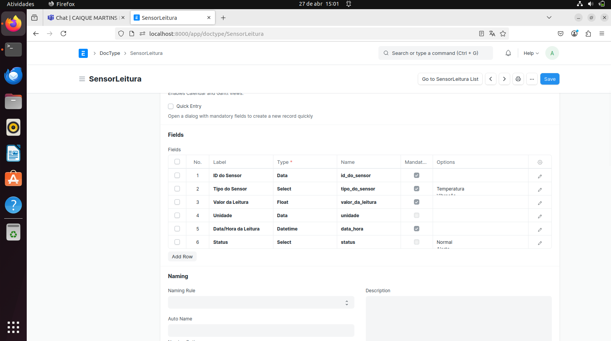
  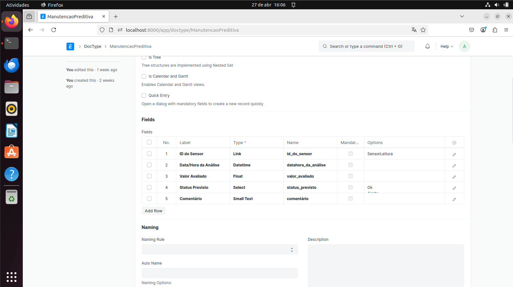
</p>

<p align="center">
  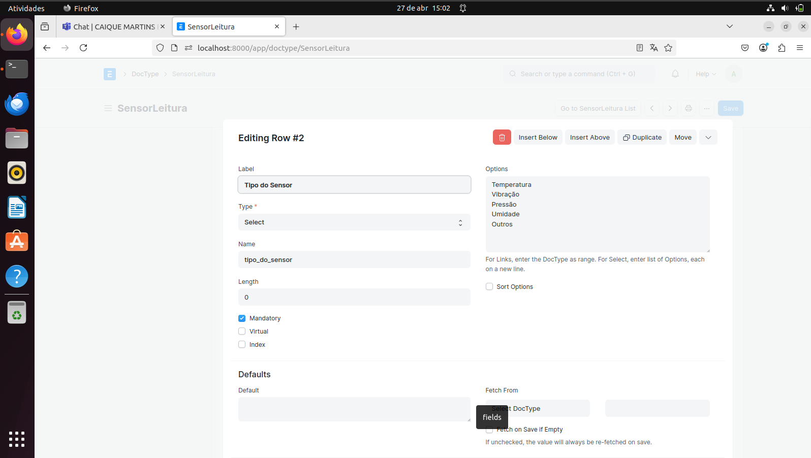
  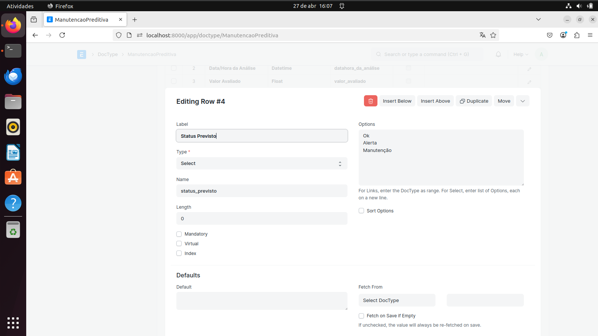
</p>

---

## 🔎 Audit Logging

Automated analyses are registered through the custom DocType:

```text
LogExecucaoIA
```

The audit record stores information such as:

- Execution date and time
- Responsible user
- Simulation scenario
- Execution status

This provides traceability for automated decisions and allows previous executions to be reviewed.

---

## 🔐 Information Security

Security was an important component of the project.

### Role-Based Access Control

ERPNext permissions were configured according to different user responsibilities:

- Operator
- Maintenance Technician
- AI Analyst
- Supervisor

The objective is to restrict each profile to the actions required for its activities.

### Input Validation

Sensor data is validated before being processed to reduce the risk of inconsistent or invalid information affecting the predictive analysis.

### Auditability

Automated executions are recorded through audit logs, providing traceability of the system's decisions.

### Network Access Restriction

The laboratory environment also used `iptables` to restrict access to the ERPNext development service.

```bash
sudo iptables -A INPUT -p tcp --dport 8000 -s 127.0.0.1 -j ACCEPT
sudo iptables -A INPUT -p tcp --dport 8000 -j REJECT
```

The following screenshot shows the firewall rules applied in the development environment:

<p align="center">
  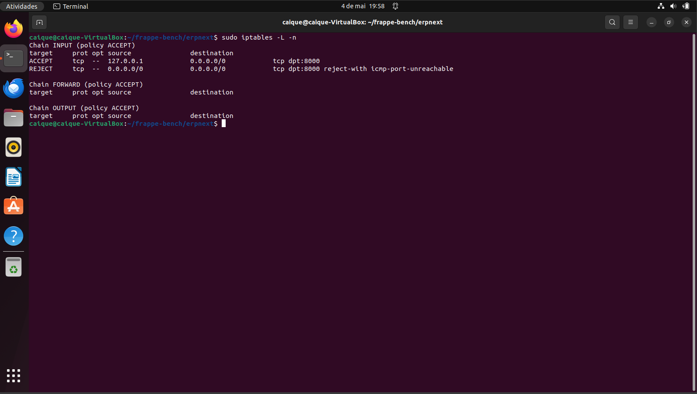
</p>

---

## 🧪 Test Scenarios

Three simulated datasets were used to validate the behavior of the predictive-maintenance system.

### Scenario 1 — Sensor Instability

This scenario simulates sensor readings close to the transition between normal and alert conditions.

The objective was to verify whether the system could distinguish acceptable variations from conditions requiring attention.

**Dataset:**  
[`scenario-1-sensor-instability.csv`](data/scenario-1-sensor-instability.csv)

<p align="center">
  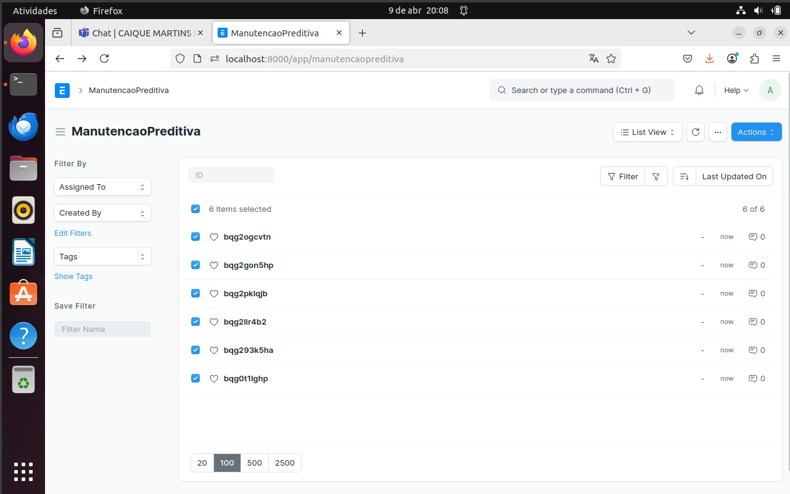
  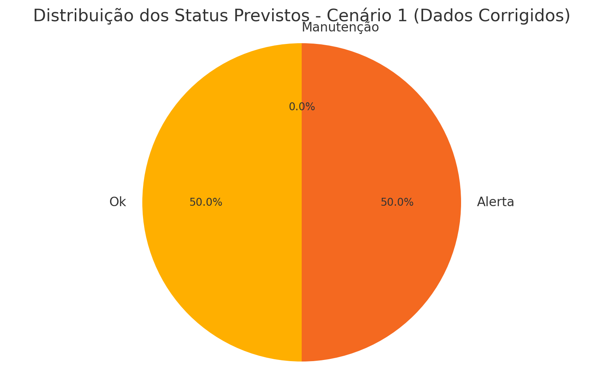
</p>

---

### Scenario 2 — Mixed States

This dataset contains readings representing different operational states.

The objective was to evaluate whether the system could process normal, alert and maintenance conditions within the same scenario.

**Dataset:**  
[`scenario-2-mixed-states.csv`](data/scenario-2-mixed-states.csv)

<p align="center">
  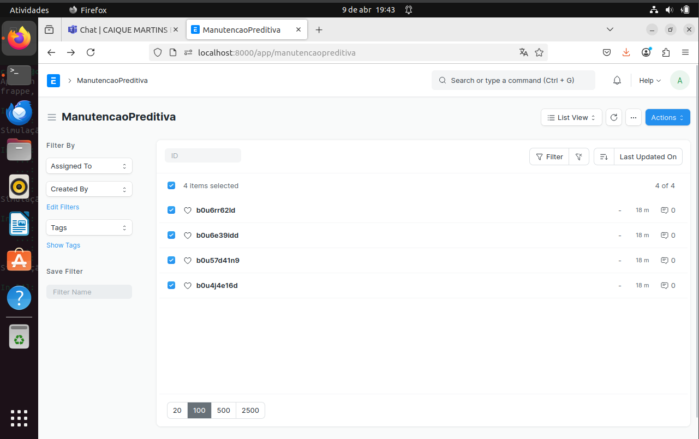
  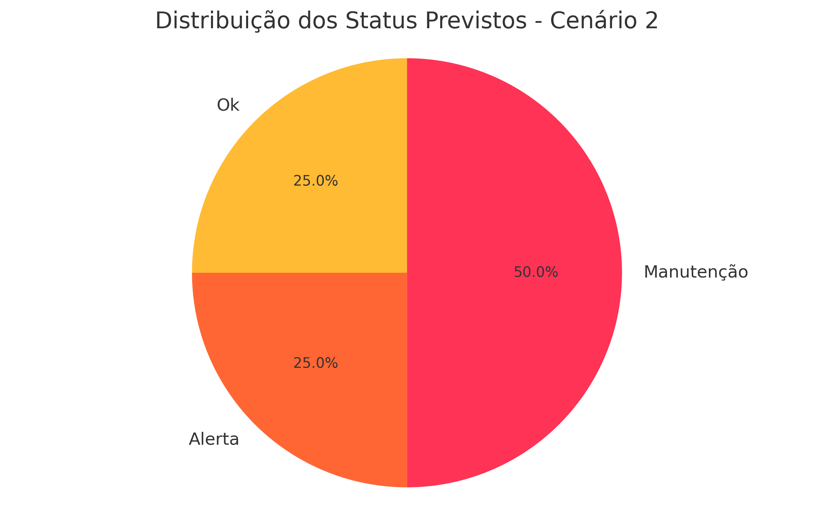
</p>

---

### Scenario 3 — Multiple Failures

The third scenario represents multiple abnormal sensor readings occurring within a short period.

The objective was to evaluate the system's response when several critical conditions were detected simultaneously.

**Dataset:**  
[`scenario-3-multiple-failures.csv`](data/scenario-3-multiple-failures.csv)

<p align="center">
  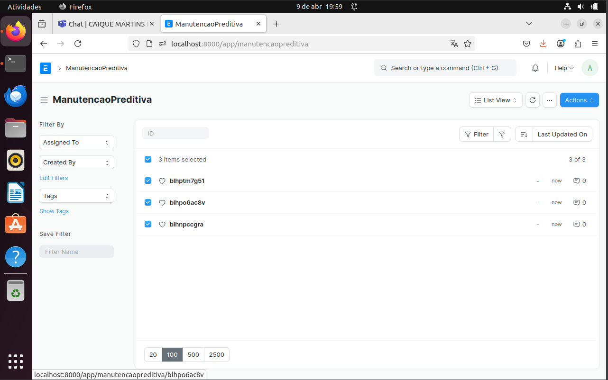
  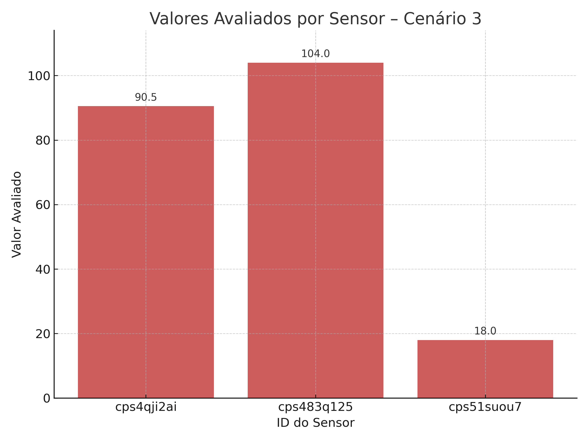
</p>

---

## 📊 Results

The prototype demonstrated the complete predictive-maintenance workflow:

```text
Sensor Data
    ↓
ERPNext
    ↓
Rule-Based Analysis
    ↓
Equipment Classification
    ↓
Predictive Maintenance Record
    ↓
Audit Log
```

The experiments demonstrated:

- Automated sensor-data processing
- Detection of abnormal readings
- Classification of equipment conditions
- Automatic creation of predictive-maintenance records
- Integration between Python and ERPNext/Frappe
- Execution audit logging
- Role-based access control
- Network access restrictions
- Processing of multiple simulated operational scenarios

The tests demonstrate the feasibility of combining sensor information, rule-based automated analysis and ERP management in a predictive-maintenance prototype.

---

## 🛠️ Technologies

- Python
- ERPNext
- Frappe Framework
- MariaDB
- Ubuntu Linux
- VirtualBox
- Bash
- iptables
- Redis
- Node.js
- Yarn
- IoT concepts
- Artificial Intelligence
- Expert Systems
- Information Security

---

## 📂 Repository Structure

```text
.
├── README.md
├── SECURITY.md
├── LICENSE
├── .gitignore
│
├── docs/
│   ├── SETUP.md
│   └── tcc.pdf
│
├── scripts/
│   ├── install_erpnext.sh
│   └── predictive_maintenance.py
│
├── data/
│   ├── scenario-1-sensor-instability.csv
│   ├── scenario-2-mixed-states.csv
│   └── scenario-3-multiple-failures.csv
│
└── images/
    ├── erpnext/
    │   ├── sensor-reading-doctype.png
    │   ├── sensor-types.png
    │   ├── predictive-maintenance-doctype.png
    │   └── predicted-status-field.png
    │
    ├── results/
    │   ├── scenario-1-overview.png
    │   ├── scenario-1-status-distribution.png
    │   ├── scenario-2-overview.png
    │   ├── scenario-2-status-distribution.png
    │   ├── scenario-3-overview.png
    │   └── scenario-3-sensor-values.png
    │
    └── security/
        └── iptables-rules.png
```

---

## 🗺️ Roadmap

- [x] ERPNext integration
- [x] Custom sensor data structures
- [x] Rule-based predictive analysis
- [x] Predictive maintenance records
- [x] Audit logging
- [x] Role-based access control
- [x] Network access restriction
- [x] Simulated test datasets
- [ ] Physical IoT sensor integration
- [ ] Real-time monitoring dashboard
- [ ] Historical sensor dataset
- [ ] Machine learning models
- [ ] Automated periodic analysis
- [ ] Production security hardening

---

## 🚀 Future Improvements

Possible future improvements include:

- Integrating physical IoT sensors
- Using real historical equipment data
- Replacing or complementing fixed rules with machine learning models
- Implementing anomaly detection techniques
- Creating interactive dashboards
- Automating periodic analyses
- Expanding security controls for production environments

Potential machine-learning approaches include:

- Decision Trees
- Neural Networks
- Logistic Regression
- Clustering
- Anomaly Detection

---

## ⚠️ Project Scope

This repository represents an **academic prototype and laboratory environment**.

The datasets used in the experiments were simulated, and the security configuration was designed for the controlled development environment used during the project.

A real industrial deployment would require additional validation, physical sensor integration, infrastructure configuration and security hardening.

---

## 📄 Academic Project

**Final Undergraduate Project**

**IA e IoT Aplicado em Manutenção Preditiva e Segurança de Dados na Indústria 4.0**

Information Security Technology  
FATEC Americana — Ministro Ralph Biasi  
2025

The complete academic document is available in the `docs/` directory.

---

## 👨‍💻 Author

**Caique Martins Braz**

Information Security Technology — FATEC Americana
